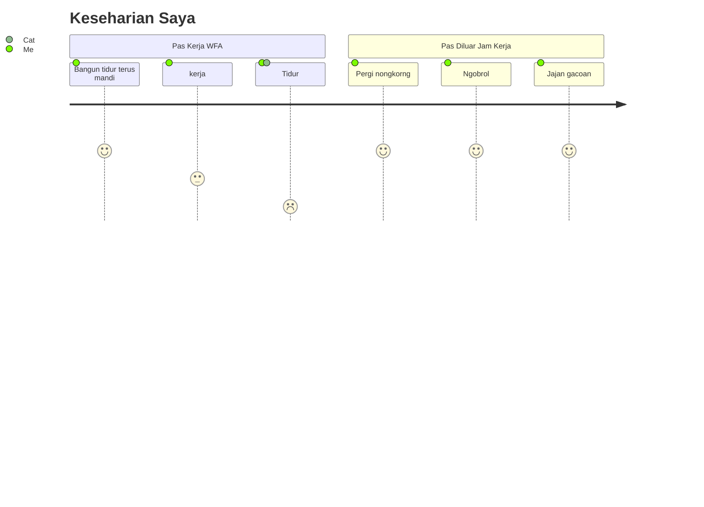

# Barnando Akbarto Hidayatullah - Nando

Introducing Barnando, also known as Nando, a programming aficionado since 2016. With a strong focus on exploring FOSS (Free Open Source Software) and actively contributing to multiple Open Source projects, he's constantly honing his skills.

Discover his impressive skill set below. Don't just skim through it, let's connect over a cup of coffee and dive into exciting discussions.

## Stats

| GitHub Stats                                                                                                                      | Streak Stats                                                                                                                       |
|-----------------------------------------------------------------------------------------------------------------------------------|------------------------------------------------------------------------------------------------------------------------------------|
|  |  |

## Work Life Balance

<h3 align="left">Connect with me:</h3>

  
  
  
  
  

